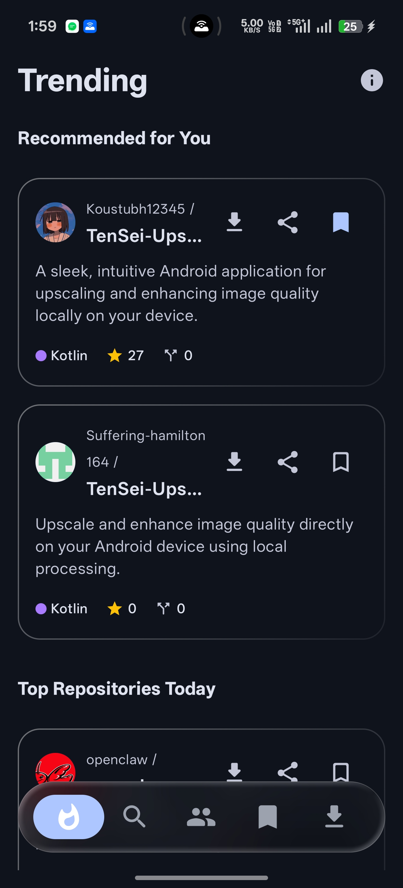
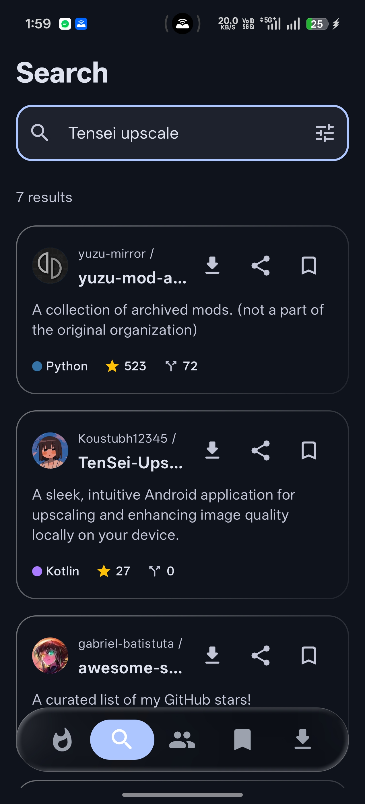
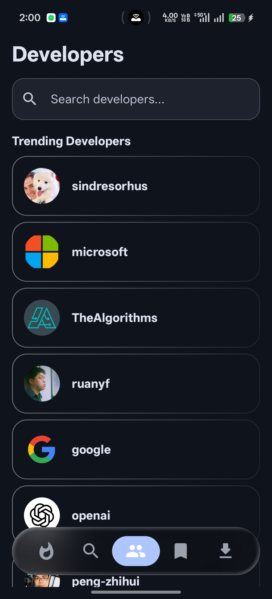
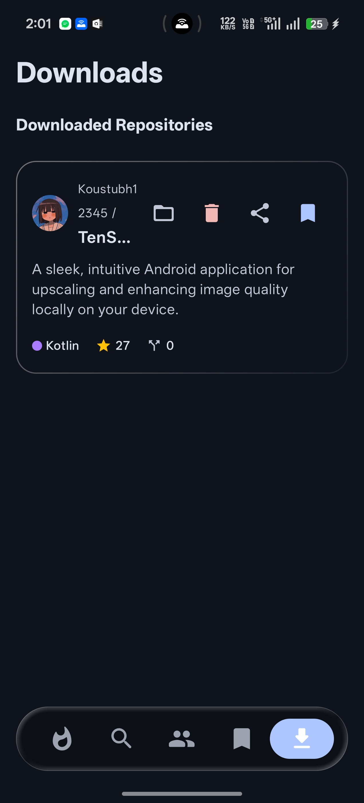
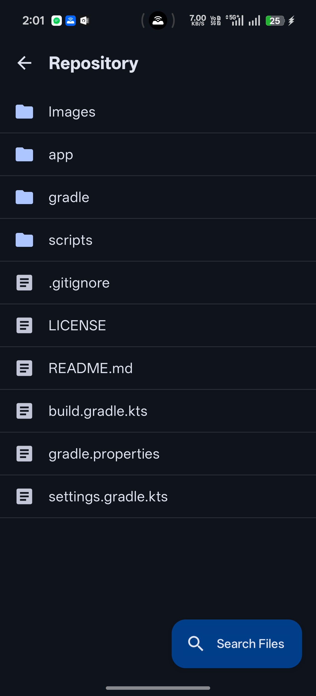

  
    
  

  
  
  

---

<pre><code class="language-javascript">const GitAtlas = {
    ui:       ["Liquid Glass", "Material X", "Heavy Blurs", "Compose Animations"],
    features: ["Smart Recommendations", "In-App Code Viewer", "Direct APK/Repo Downloads"],
    engine:   ["Search History Tracking", "Bookmark Language Matching", "Multi-Tag OR Queries"],
    data:     ["Offline Bookmarks", "Encrypted SharedPreferences", "Retrofit2"],
    status:   "Source Visible (All Rights Reserved)",
};</code></pre>

---

## ⚡ Installation

GitAtlas is distributed as a compiled Android APK.

1. Head over to the **[Releases](../../releases/latest)** tab.
2. Download the latest APK file.
3. Allow "Install unknown apps" if prompted by Android and launch the app.

## 📱 Interface

| Trending | Search | Developers | Downloads | Repository |
| :--- | :--- | :--- | :--- | :--- |
|  |  |  |  |  |

## 🧠 The Engine

Unlike generic GitHub clients, GitAtlas features a custom recommendation engine built specifically for power users. It doesn't just show trending lists—it actively reads your local search history and your bookmarked repository languages to build a massive, targeted query against the GitHub API. 

If you search for "rvx" and bookmark a "Python" project, your feed automatically calibrates to show you exactly that using advanced multi-tag filtering.

## ⚠️ License & Usage

**© 2026 TenSei Mods. All Rights Reserved.**

The source code for GitAtlas is provided for **viewing and educational purposes only**. 

You are **strictly prohibited** from copying, modifying, distributing, compiling, or using any part of this source code or UI design in your own projects without my explicit, written authorization. 

If you wish to fork, modify, or utilize elements of this repository, you must contact me directly to request permission first.

  
Developed and maintained by <b>TenSei</b>

  
  

